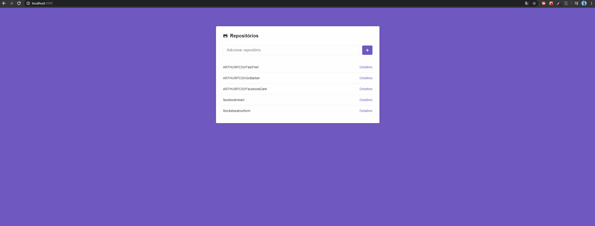

# AppRepository
Aplicação feita em ReactJS, para adicionar repositórios consumindo a API do GitHub.

## :rocket: Sobre o desafio

Desenvolver uma aplicação utilizando ReactJS.

## :gear: O que foi utilizado:
<ul>
  <li>React hooks</li>
  <li>Styled Components</li>
  <li>Api do github</li>
  <li>Axios</li>
</ul>

## :camera: Imagens

